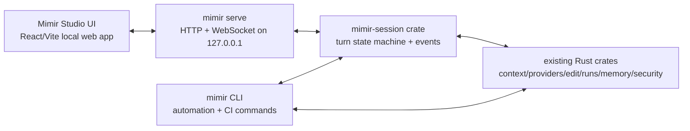

# Mimir UI Product Plan

This plan turns Mimir into a polished local coding workspace while keeping the CLI and Rust engine as the backend. The UI should feel familiar to users of Codex, Claude Code, OpenCode, Cline, Continue, OpenHands, and Bolt, but make Mimir's core advantage obvious: every agent turn is governed by inspectable, replayable, right-sized context.

## Reference Study

Reference repositories were cloned shallowly into `/tmp/mimir-ui-references` for product and architecture study only. Do not copy code or UI assets from them.

| Reference | Why It Matters | Pattern To Borrow |
| --- | --- | --- |
| `openai/codex` | Terminal-native coding agent with strong session, approval, slash-command, diff, and snapshot-test patterns. | Typed event history, approvals as first-class cells, status/token header, dense command surface. |
| `OpenHands/OpenHands` | Full web app for autonomous development with chat, files, terminal, browser, diffs, conversation state, WebSocket updates, and tests. | Local/remote conversation event stream, tabbed workspace, file/diff/terminal panes, resilient reconnect. |
| `opencode-ai/opencode` | TUI-first coding agent with sessions, command dialogs, permission overlays, token/context indicators, and themed chat UI. | Permission modal vocabulary: allow once, allow session, deny; visible context-window pressure. |
| `cline/cline` | IDE webview with mature chat UX, auto-approve controls, context mentions, settings, history, MCP, browser, and task headers. | Composer ergonomics, provider settings, auto-approval controls, checkpoint-oriented history. |
| `continuedev/continue` | IDE/CLI architecture with context providers, slash commands, tool permissions, diff tools, and rich mention input. | Context provider abstraction, slash command registry, TipTap-style mention composer, policy-backed tools. |
| `stackblitz/bolt.new` | Web coding workbench with chat, artifacts, file tree, editor, terminal, preview, and streaming action parser. | Chat/workbench split, artifact runner model, CodeMirror/terminal integration, lightweight file explorer. |

## Product Goal

Build **Mimir Studio**, a local web UI launched by `mimir ui`, backed by `mimir serve`. The CLI remains stable for automation, scripts, and CI. The UI becomes the ergonomic interface for daily coding.

Primary promise:

> Mimir helps AI coding agents make more accurate edits by making context selection, context limits, edit permissions, evidence, and replay artifacts visible before the model acts.

## Product Principles

1. **Familiar usage, stronger guarantees.** Users should type tasks, mention files, approve diffs, run tests, and resume sessions like other coding apps.
2. **Context is the product.** Every turn shows included files, risky omissions, token budget, packet hash, and replay artifacts.
3. **Fail closed.** Provider calls, edits, shell commands, secrets, dirty files, and external paths require explicit policy.
4. **No hidden magic.** Every meaningful action emits an event and writes an artifact.
5. **Local first.** Bind the server to loopback, use short-lived UI tokens, and never store provider secrets in the UI bundle or project files.
6. **CLI parity.** Every UI workflow maps to an auditable CLI/backend operation.

## Recommended Architecture



The UI should not shell out to `mimir plan` or `mimir code` for core workflows. Extract command logic into shared library APIs, then let both the CLI and server call those APIs. Shelling out is acceptable only for prototype smoke commands.

## Proposed Workspace Layout

```text
crates/
  mimir-session/        # shared turn orchestration and event model
  mimir-server/         # HTTP/WebSocket UI API plus existing JSON-RPC/LSP path
apps/
  studio/               # React/Vite frontend
    src/
      api/
      components/
      features/
        chat/
        context/
        diff/
        approvals/
        files/
        terminal/
        artifacts/
        settings/
      routes/
      stores/
      test/
packages/
  sdk/                  # generated TS event/client types, if useful
```

## Core UX

### First Launch

`mimir ui` should:

1. Verify the current directory is a Git repo or offer `mimir init`.
2. Start `mimir serve` on a random loopback port.
3. Mint a short-lived local UI token.
4. Open the browser at `http://127.0.0.1:<port>/?token=...`.
5. Show a repo readiness card: Git status, provider status, Mimir config, checks, recent runs.

### Main Session Screen

Use a workbench layout:

```text
Left rail            Center                         Right inspector
---------            ------                         ---------------
Sessions             Transcript                     Context
Files                Composer                       Diff
Runs                 Tool events                     Tests
Checks                                              Artifacts
Memory                                              Approvals
Settings                                            Provider
```

Header:

- Repo name, branch, dirty state.
- Mode: Ask, Explore, Plan, Code, Review.
- Provider/model.
- Context budget: `42k / 64k`, reserve, risk status.
- Current run id and packet hash shortcut.

Composer:

- Plain task entry by default.
- `@file` and `@symbol` mentions with fuzzy search.
- `/` slash commands.
- `!` shell command entry with policy warning.
- Editable target chips for code mode.
- Cost cap and auto-test controls.
- Send, stop, retry, and branch-session actions.

Right inspector:

- **Context:** included files/ranges, risky omissions, why included/omitted, packet replay.
- **Diff:** file-by-file diff, approve/apply/reject, open in editor.
- **Tests:** detected tests, suggested tests, safe auto-run status, failures.
- **Artifacts:** redacted request, response, plan, patch recipe, patch report, trace.
- **Approvals:** pending and historical permission decisions.
- **Provider:** model, capability snapshot, token estimates, costs, errors.

## Slash Commands

Initial command set:

| Command | Behavior |
| --- | --- |
| `/help` | Show command palette and shortcuts. |
| `/status` | Repo, provider, token budget, dirty files, current session. |
| `/init` | Run project initialization without overwriting existing files. |
| `/doctor` | Run environment/provider/config checks. |
| `/context` | Build or refresh a context packet for current task. |
| `/why <path>` | Explain why a file was included or omitted. |
| `/explore <question>` | Provider-free evidence search, then optional provider-backed summary later. |
| `/plan <task>` | Provider-backed implementation plan, no edits. |
| `/code <task>` | Provider-backed patch flow with explicit editable targets. |
| `/check` | Run source-controlled `.mimir/checks/*.md`. |
| `/diff` | Show current Git diff and Mimir patch artifacts. |
| `/runs` | Browse previous runs and artifacts. |
| `/resume` | Resume a previous session. |
| `/share` | Create redacted packet/replay bundle. |
| `/settings` | Provider/model, approval policy, caps, theme. |

Later:

- `.mimir/commands/*.md` should appear as project slash commands.
- Slash command results should be typed events, not raw text blobs.

## Backend API

Expose a local HTTP + WebSocket API from `mimir serve --ui`.

### HTTP

| Endpoint | Purpose |
| --- | --- |
| `POST /v1/sessions` | Create a UI session for a workspace. |
| `GET /v1/sessions` | List resumable sessions. |
| `GET /v1/sessions/:id` | Load session metadata and current state. |
| `POST /v1/sessions/:id/messages` | Submit user prompt or slash command. |
| `POST /v1/sessions/:id/cancel` | Cancel active turn. |
| `POST /v1/approvals/:id/respond` | Allow once, allow session, or deny. |
| `GET /v1/runs/:run_id/artifacts` | List run artifacts. |
| `GET /v1/runs/:run_id/artifacts/:name` | Fetch redacted artifact. |
| `GET /v1/workspace/files` | Fuzzy file/symbol search for mentions. |
| `GET /v1/workspace/status` | Git, config, checks, provider readiness. |

UI-facing response DTOs expose display-safe workspace identity. `SessionMetadata`,
`session.created`, and `WorkspaceStatus` use `workspace_name`; absolute
`workspace_root` is internal-only except for the optional `POST /v1/sessions`
request field, which is accepted only when it resolves to the server workspace.
Run, packet, artifact, replay, and share paths returned to Studio are
workspace-relative display paths.

### WebSocket Events

Every UI update should flow through typed events:

```text
session.created
turn.started
composer.accepted
context.build.started
context.packet.ready
context.omission.risk
provider.request.ready
provider.chunk
provider.completed
approval.requested
approval.resolved
patch.plan.ready
patch.diff.ready
patch.apply.started
patch.apply.completed
test.detected
test.started
test.completed
artifact.written
turn.completed
turn.failed
```

Events should be append-only and persisted to `.mimir/sessions/<session-id>/events.jsonl` or a small SQLite store. The UI can rebuild state from the log. Persisted events should avoid absolute local paths and provider secrets; legacy logs with absolute paths remain readable, but new path-bearing events should be workspace-relative.

## Shared Session State Machine

Add a `mimir-session` crate with:

- `SessionStore`: create/list/load/resume.
- `TurnRunner`: executes ask/explore/plan/code/check/review workflows.
- `EventSink`: writes events to WebSocket, JSONL, and tests.
- `ApprovalBroker`: pauses unsafe operations until the UI responds.
- `ToolPolicy`: read, edit, shell, network, provider, test, packet share.
- `ArtifactIndex`: maps run ids to redacted artifacts and checksums.
- `CommandRegistry`: built-in slash commands plus `.mimir/commands/*.md`.

The CLI should eventually call this crate too, so behavior stays consistent.

## Security Model

Minimum release bar:

- Bind UI server to `127.0.0.1` only.
- Generate random per-process UI token.
- Reject requests without token.
- Reject browser origins other than the local UI origin.
- Never expose provider environment variables to the frontend.
- Redact secrets in streamed events and artifacts.
- Require explicit editable paths before code mode can mutate files.
- Refuse pre-existing dirty editable targets unless the user explicitly stages/acknowledges.
- Show diff before apply unless policy says otherwise.
- Shell commands must be approve-once by default.
- Network/provider calls must show model, base URL, token estimate, cap, and redacted request path.
- All path inputs must canonicalize under workspace or explicit allowed roots.

## Design System

Recommended stack for the first version:

- React + TypeScript + Vite.
- Tailwind CSS with Radix primitives or shadcn-style local components.
- TanStack Query for HTTP state.
- Zustand for volatile UI/session state.
- Monaco for diff/editor views.
- xterm.js for terminal output and later interactive terminal support.
- React Markdown + Shiki or lowlight for transcript rendering.
- Vitest + Testing Library for components.
- Playwright for end-to-end UI smoke tests.

Visual tone:

- Quiet, dense, technical, not a marketing page.
- Dark and light themes.
- No oversized hero sections.
- No decorative gradients/orbs.
- Persistent status, context budget, and approvals.
- Prefer tabs, segmented controls, chips, icons, and structured panes over explanatory text blocks.

## Implementation Phases

### Phase 0: Decisions and Boundaries

Deliverables:

- Confirm app name: `Mimir Studio` or `Mimir Workbench`.
- Confirm local web first, Tauri later.
- Choose frontend package manager and component stack.
- Decide whether sessions use JSONL initially or SQLite immediately.

Acceptance:

- `docs/mimir-ui-product-plan.md` is accepted as the target plan.

### Phase 1: Backend Extraction

Deliverables:

- Add `crates/mimir-session`.
- Move reusable command orchestration out of `crates/mimir-cli/src/main.rs`.
- Define `SessionEvent`, `SessionCommand`, `ApprovalRequest`, and `ArtifactRef` schemas.
- Keep existing CLI behavior unchanged.

Acceptance:

- Existing CLI tests pass.
- A unit test can run a provider-free `context suggest` turn through `mimir-session`.
- No frontend exists yet.

Status:

- Initial vertical slice landed in `crates/mimir-session`.
- The new crate owns durable session metadata, append-only JSONL session events, initial slash command parsing, approval/artifact schemas, and a provider-free context suggestion turn.
- `mimir context suggest` now routes through `mimir-session::TurnRunner::suggest_context` while preserving CLI output behavior; the next backend step is to route additional provider-free commands such as `check`, `explore`, and `doctor` through the same session layer.

### Phase 2: Local UI Server

Deliverables:

- Extend `mimir serve` with `--ui`.
- Add local auth token, CORS/origin checks, and loopback binding.
- Add HTTP endpoints for workspace status, file search, session create/list/load, artifacts.
- Add WebSocket event stream with replay-from-last-event support.

Acceptance:

- `curl` can create a session, submit `/status`, and stream events.
- Requests without token fail.
- Path traversal tests fail closed.

Status:

- Complete: `mimir serve --ui` now starts a loopback-only HTTP/WebSocket API with per-process token auth, local-origin checks, durable `mimir-session` create/list/load, provider-free message submission for `/status`, `/doctor`, `/check`, `/explore`, `/context`, workspace status, file/symbol search, redacted artifact listing/fetching, cancel/approval placeholder endpoints, and WebSocket event replay with `after` sequence support.

### Phase 3: UI Scaffold

Deliverables:

- Add `apps/studio`.
- Implement shell layout: left rail, center transcript, right inspector, header, composer.
- Mock event stream mode for fast UI development.
- Add routing for sessions and settings.

Acceptance:

- `pnpm dev` renders a usable mock session.
- Playwright verifies no blank screen and composer input works.
- UI passes typecheck and lint.

### Phase 4: Real Sessions and Commands

Deliverables:

- `mimir ui` starts the server and opens the local app.
- UI connects to WebSocket and renders session events.
- Implement `/help`, `/status`, `/init`, `/doctor`, `/context`, `/why`, `/runs`.
- Add `@file` fuzzy mention picker backed by file search.

Acceptance:

- Fresh repo can run `mimir ui`, initialize, build context, inspect omissions, and browse artifacts without provider credentials.

### Phase 5: Provider Ask/Plan

Deliverables:

- Implement ask and plan turns in the UI.
- Stream provider chunks.
- Show redacted request and response artifacts.
- Show model/cost/cap status before provider dispatch.

Acceptance:

- With provider credentials, user can ask and plan from the UI.
- Without credentials, UI gives actionable provider setup guidance.
- Provider request artifacts remain redacted.

### Phase 6: Code Mode With Approvals

Deliverables:

- Editable target selector.
- Approval modal for provider call, patch apply, shell/test command, network if applicable.
- Monaco diff viewer.
- Apply, reject, rerun, and inspect patch recipe.
- Test runner panel with safe auto-run behavior.

Acceptance:

- UI can complete a small edit through plan, diff, approval, apply, and test.
- Unsafe paths, dirty targets, and secret-like patches fail closed.

### Phase 7: Context Advantage Features

Deliverables:

- Context score: sufficiency, risky omissions, token pressure, recall flags.
- Context comparison across turns.
- "Why this context?" view per file/range.
- "What would improve accuracy?" suggestions: include tests, config, schema, callers, docs.
- Replay/share packet actions.

Acceptance:

- User can see why Mimir is more accurate than high-context dumping.
- UI can demonstrate a smaller packet beating broad context in local eval/replay examples.

### Phase 8: Terminal and Workbench Polish

Deliverables:

- xterm.js read-only command output first.
- Optional interactive terminal later with explicit approval/session policy.
- File tree and read-only file viewer.
- Artifact previews for JSON, Markdown, diff, trace.
- Keyboard shortcuts and command palette.
- Session resume/search/export.

Acceptance:

- Daily use feels comparable to coding agent apps, but with stronger inspection and replay.

### Phase 9: Desktop Packaging

Deliverables:

- Evaluate Tauri wrapper around the same frontend.
- Add app icon, update flow, notarization/signing path if needed.
- Keep web UI as the development/default path until desktop packaging is boring.

Acceptance:

- Same UI works in browser and Tauri.
- CLI release remains usable without the desktop app.

## Local Development Commands

Target command shape after implementation:

```bash
# backend only
mimir serve --ui --port 0

# frontend dev
cd apps/studio
pnpm install
pnpm dev

# one-command product flow
mimir ui

# no-provider local smoke
mimir ui --mock-provider
```

## Test Plan

Backend:

- Unit-test session state transitions.
- Unit-test slash command parsing.
- Unit-test approval broker behavior.
- Unit-test path canonicalization and token auth.
- Integration-test WebSocket replay.
- Integration-test provider-free context turns.
- Mock-provider tests for ask/plan/code.

Frontend:

- Component tests for composer, command palette, file mention picker, context panel, diff panel, approval modal.
- Store tests for event-log reduction.
- Accessibility checks for keyboard-only use and focus traps.
- Playwright smoke for first launch, context build, ask with mock provider, code approval flow.

Security:

- No provider secret in DOM, local storage, logs, WebSocket events, or artifacts.
- Cross-origin request rejected.
- Path traversal rejected.
- External symlink edit rejected.
- Dirty editable file warning blocks apply.
- Shell approval cannot be bypassed with slash commands.

Performance:

- UI initial load under 2 seconds in local dev on warm build.
- Event append renders without transcript jank for 1,000 events.
- Large artifacts lazy-load and virtualize.
- Context panel handles hundreds of included/omitted items.

## Minimum Lovable Product

Ship this before building the full workbench:

1. `mimir ui` launches a local browser app.
2. App shows repo readiness and provider status.
3. User can type a task.
4. User can mention files with `@`.
5. UI builds a context packet and shows included/risky omitted files.
6. User can ask or plan with provider streaming.
7. User can inspect redacted request/response artifacts.
8. User can resume the session.

Code mode can follow immediately after, but the context-first ask/plan loop proves the product.

## Why Mimir Can Beat Traditional High-Context Coding Apps

Traditional high-context tools often hide context selection or solve accuracy by stuffing more tokens into the prompt. Mimir should compete differently:

- Smaller, higher-quality packets over larger vague context.
- Explicit omitted-context risk instead of silent misses.
- Replayable packet hashes instead of uninspectable chat state.
- Editable target enforcement instead of broad write access.
- Redacted provider artifacts instead of opaque calls.
- Eval-backed context quality instead of anecdotal confidence.

The UI should make that visible every minute the user is working.
